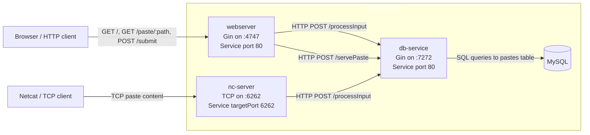

+++
title = "Shellbin Project Writeup"
date = 2026-03-04
slug = "shellbin"
+++


<!--

todo:

[/] discuss each microservice briefly
[] discuss CI/CD process
[] discuss kubernetes cluster 

-->

## Introduction

Shellbin is a microservice architecture project that I built to exercise my understanding of CI/CD for cloud-native applications.

It's named shellbin because it's a pastebin clone that you can access with your shell using Unix pipes and the `netcat` utility.

```fish
cat $FILE | nc <shellbin.address>
```

The product is intentionally simple, it's just a pastebin clone. This lets us think about the DevOps aspects of the project without worrying too much about the product implementation.

### Technical Overview
- There are four container images involved in shellbin. Three containers use custom binaries built with go, and one container is stock mysql.

- There are two repos involved in building and deploying shellbin:

1. `england2/shellbin`
    - Contains both application source code **and** templating/build files (Dockerfiles and Helm chart)
    - Builds and pushes the container images via GitHub Actions
    - Defines how the application is deployed onto Kubernetes via Helm
2. `england2/cluster-repo`
    - Is the main GitOps repository for my local cluster; holds cluster related configuration
    - Declares the desired state of the Kubernetes cluster
    - Exposes `shellbin` configuration plainly, allowing for a simpler mutli-repo deployment pipeline
    - Allows us to actually deploy `shellbin` easily

- the deployment pipeline is based on ArgoCD, GitHub Actions, and GHCR.

### Source code!
The good stuff right up front.

Here's the [shellbin source code](https://www.github.com/england2/shellbin), and here's the [cluster-repo source code](https://www.github.com/england2/cluster-repo).

## Project Structure



### Serivces description

- `webserver`
  - provides web interface to create and view posts
- `nc-service`
  - provides netcat server to create pastes from the commandline
- `db-service`
  - shared layer database layer
  - used by both webserver and nc-server to interact with the database
- `mysql`
    - basic `mysql` container representing the database

## How does the CI/CD work?

## ArgoCD

First, lets cover ArgoCD. ArgoCD is a declarative GitOps system for Kubernetes. This means that it uses a git repo as a _"source of truth"_, and reconciles the cluster state to match the yaml/state that's defined in the repo.

Here's a basic example.
- ArgoCD is configured to watch a certain folder named `test-dir` that exists in a git repo.
- I define a Kubernetes resource in `test-dir` in a .yaml file.
- I commit and push this change to the git repo.
- ArgoCD detects this change and creates this resource automatically!

And here are some additional details that are relevant this project.
- ArgoCD can be configured to watch a folder in _any repository_, not just the main cluster configuration repo.
- ArgoCD can be configured to watch a folder representing a _full Helm chart_ (and deploy it as such), not just separate yaml files.
- ArgoCD can select a different helm values.yml chart than what is shipped in the default Helm release.

This helps us define the `shellbin` deployment agnosticly. Its deployment is not _tied_ ArgoCD, anyone with Helm can deploy it.

ArgoCD allows for deployment of related Kubernetes resources using what it calls an "Application".
The following a snippet of our ArgoCD Application definition along with relevant comments.

[application-shellbin.yml](https://github.com/england2/cluster-repo/blob/master/argocd-reconciled-yaml/cluster-yaml/applications-argocd-config/application-shellbin.yml)

```yaml
# ...
  sources:
    # selecting our shellbin repo as a source
    - repoURL: git@github.com:england2/shellbin.git
      targetRevision: HEAD
      # `path: helm` refers to the `helm` folder in england2/shellbin, the
      # folder where our shellbin Helm chart lives
      path: helm
      # stating that we're deploying as a Helm Chart
      helm:
        releaseName: shellbin
        valueFiles:
        # telling ArgoCD to ignore the default Helm values, and use one
        # defined in the `cluster-repo` repository (the same repo that this file exists in).
          - $cluster-repo/argocd-reconciled-yaml/applications/shellbin/helm-values-shellbin.yml
    # enable the $cluster-repo reference that's used above, allowing us to refer to files 
    # that exist in `cluster-repo`, rather than `shellbin`.
    - repoURL: git@github.com:england2/cluster-repo.git
      targetRevision: HEAD
      ref: cluster-repo
```

To review:
- ArgoCD watches the `helm` folder in the shellbin repository for any changes
- When ArgoCD find a difference between the current shellbin deployment from what is defined in the `shellbin` repo, it updates the cluster.
- We define a seperate values.yml than what shellbin ships with 
  - specifically, we use `cluster-repo/.../helm-values-shellbin.yml`

## The actual pipeline

First, note that _shellbin_ owns the pipeline code, not _cluster-repo_. See [pipeline.yml](https://github.com/england2/shellbin/blob/master/.github/workflows/pipeline.yml) for full details.

Our cluster is watching shellbin's Helm chart within it's repo, which means that any changes to deployment manifests (i.e yaml configuration) will be reconciled to our cluster.

However, Helm is only a templating engine! It helps us define and deploy yaml, but it has no knowledge of our container images aside from a string that refers to them in a container registry.

Therefore, we still need to: 
1. build and push our container images
2. tell our cluster to use the new images


### build and push our container images
Building and pushing pure-go images is super simple, especially when using GHCR.

The full [pipeline.yml](https://github.com/england2/shellbin/blob/master/.github/workflows/pipeline.yml) is very easy to read, so I can reccommend just checking that out.

The important note here is this:
- our build and deployment `shellbin` of ultimately relies on two seperate repos 
- the exact state of our Go binaries is determined by our shellbin repo
- therefore, when we push 


The state of our build images is tied to a commit in `shellbin`, so we use this commit's SHA to tag the images we build:

```yaml
# ...
          tags: |
# update the base image tag, so that any deployment refering to a unspecific image version gets the most recent one.
            ${{ env.IMAGE_REPO }}:${{ matrix.image_tag }}
# define an image tag marked by the 
            ${{ env.IMAGE_REPO }}:${{ matrix.image_tag }}-${{ github.sha }}
# ...
```

[helm-values-shellbin.yml](https://github.com/england2/cluster-repo/blob/main/argocd-reconciled-yaml/applications/shellbin/helm-values-shellbin.yml)
```yaml
# ...
webserver:
  replicaCount: 1
  name: webserver
  image:
    repository: ghcr.io/england2/shellbin
    pullPolicy: IfNotPresent
    tag: webserver-60b47cf062ab5455cd1330ee952dc9c1f07229bd
# 2 more definitions follow ...
```
