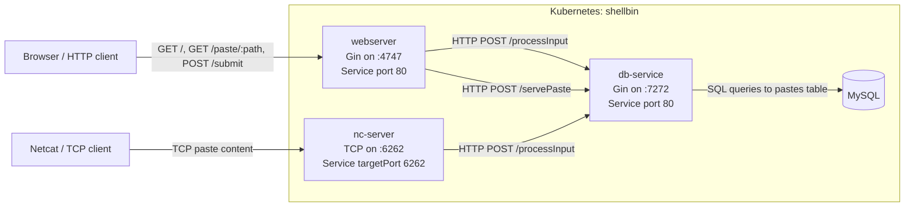

# Elan England

**This website has a few purposes:**
- To host my [resume](/resume/).
- To host short all of my tutorials and articles about miscellaneous software things.
- Show write-ups for larger scale projects I've made. See below, and click the header to see the full write-up page.

<br>

## [_Shellbin_](/shellbin/)
---

This is a microservice oriented project that I built to learn about CI/CD for cloud-native applications.

It's named shellbin because you can access it using nothing but some coreutils from a shell!
```sh
cat $FILE | nc sb. <site.url>
```

Additionally, there is a GUI web-interface that is exposed by a plain-old webserver.
The diagram below shows that both the CLI and GUI interfaces both talk to the same database-managing microservice. 


A good example of how splitting things up can _sometimes_ make architecture easier to reason about!



I also implemented full end-to-end testing and CI/CD with my local Kubernetes cluster!
Read the [full post here](/shellbin/) for more details.

<br>
    
## [_Web Terminal_](/web-terminal/)
---

This is a larger, abandoned project that I took up because I wanted to do something that at the time sounded really big and scary sounding. Basically, I wanted to write some custom golang code to interact with the Kubernetes API to create, destroy, and scale pods based on user load.

Additionally, I wanted to create an end-


Kube builder
